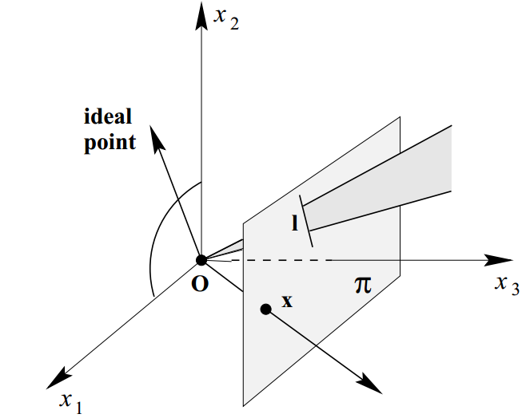

## Projective Geometry and Transformations

- [Upper Level](README.md)

#### Projective Geometry and Transformations of 2D

Refer to Part 0: Chapter 2 of *Multiple View Geometry in Computer Vision*, Second Edition, by Richard Hartley.

**Homogeneous Representation of Lines**

**l**=(a, b, c)<sup>T</sup>, for ax+by+c=0.

**Homogeneous Representation of Points**

**x**=(x, y, 1)<sup>T</sup>

**Result 2.1.**

The point **x** lies on the line **l** if and only if **x**<sup>T</sup>**l**=0.

**Result 2.2.**

The intersection of two lines **l** and **l'** is the point **x**=**l**×**l'**.

**Example**

**l**=(-1, 0, 1)<sup>T</sup> , **l'**=(0, -1, 1), **x**=

```
|  i  j  k |   [1]
| -1  0  1 | = [1]
|  0 -1  1 |   [1]

Refer to Page 27.
```

**Result 2.4.**

The line through two points **x** and **x'** is **l**=**x**×**x'**.

**Ideal Points**

Point **x**=(x<sub>1</sub>, x<sub>2</sub>, x<sub>3</sub>) where x<sub>3</sub>=0.

**Line at Infinity**

**l<sub>∞</sub>**=(0, 0, 1)<sup>T</sup>.

All ideal points lie on the line at infinity, since (0, 0, 1)(x<sub>1</sub>, x<sub>2</sub>, 0)<sup>T</sup>=0.

**Projective Plane vs. Euclidean Plane**

Projective plane IP<sup>2</sup> contains ideal points, which makes it true that two distinctive lines meet in a single point, whereas Euclidean plane does not.

**A Model for the Projective Plane**

Points in IP<sup>2</sup> are rays in IR<sup>3</sup>; lines in IP<sup>2</sup> are planes in IR<sup>3</sup>.



**Conics**

In Euclidean geometry, conics are of three types: hyperbola, ellipse, and parabola.

The equation of a conic in inhomogeneous coordinates is

ax<sup>2</sup>+bxy+cy<sup>2</sup>+dx+ey+f=0

after homogenization it is

ax<sub>1</sub><sup>2</sup>+bx<sub>1</sub>x<sub>2</sub>+cx<sub>2</sub><sup>2</sup>+dx<sub>1</sub>x<sub>3</sub>+ex<sub>2</sub>x<sub>3</sub>+fx<sub>3</sub><sup>2</sup>=0

or in matrix form

**x<sup>T</sup>Cx**=0, where C=

```
[  a  b/2 d/2 ]
[ b/2  c  e/2 ]
[ d/2 e/2  f  ]
```

**Result 2.7.**

The line **l** tangent to **C** at a point **x** on **C** is given by **l**=**Cx**.

