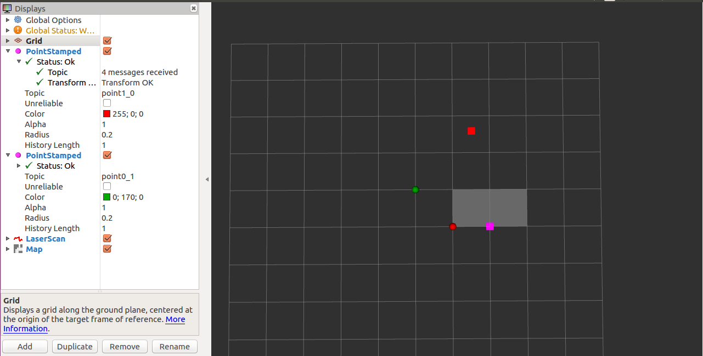
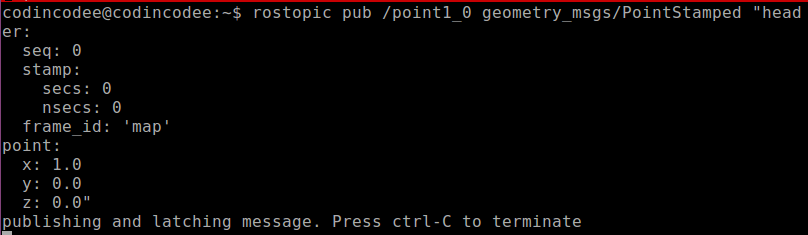
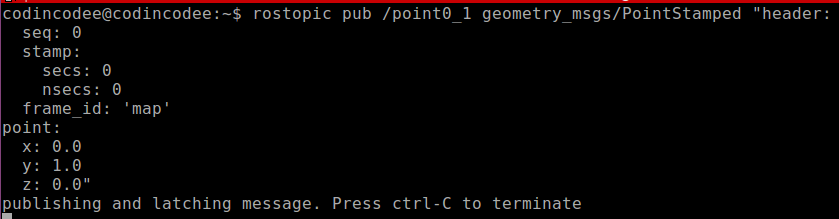
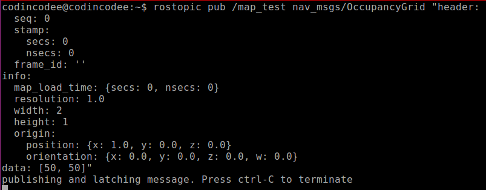
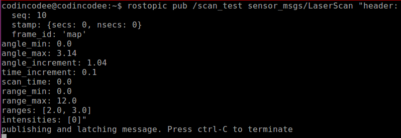

## Geometric Specifications in RViz

- [Upper Level](README.md)

#### A Test

In order to figure out the geometric specifications of the coordinate system, the LaserScan, and the OccupancyGrid, I did the following test. From the test, the answers are revealed.

- Spherical marks in red and in green are points with coordinates [1.0m, 0.0m] and [0.0m, 1.0m], respectively.
- Cubic marks in red and in pink are channels of a LaserScan with ranges of 2.0m and 3.0m and with angles of 0° and 60°, respectively.
- Grey squares are the cells of an OccupancyGrid in which the width, the height and the origin are 2, 1, and [1.0, 0.0], respectively.